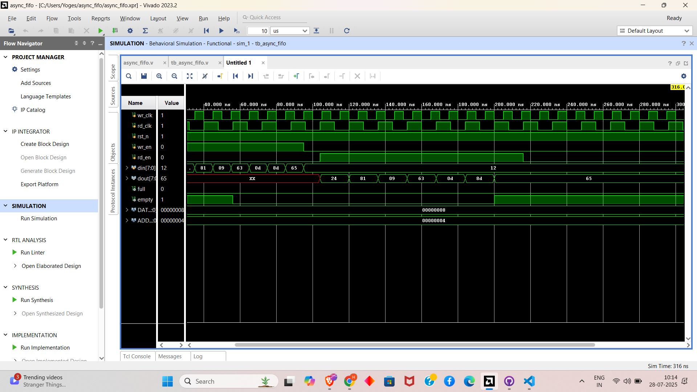
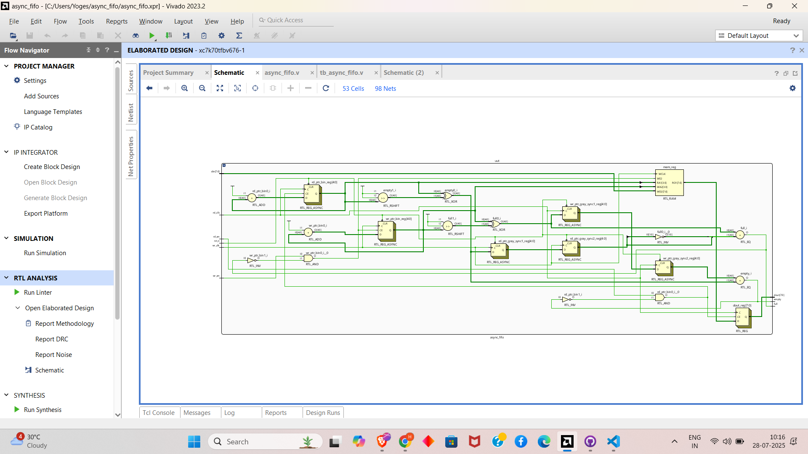

# dual-clock-fifo
🔄 Asynchronous FIFO for Clock Domain Crossing (CDC) This project implements a dual-clock FIFO in Verilog to safely transfer data between two asynchronous clock domains using Gray-coded pointers and 2-stage synchronizers. Features include full/empty flag logic, parameterizable depth and width, and a testbench simulating independent write/read clocks for robust verification.


# 🔁 FPGA Dual Clock FIFO for CDC | Prism Studio Internship project

Welcome to the **FPGA Dual Clock FIFO** project! This design demonstrates safe and reliable **asynchronous data transfer** between two independent clock domains using **Gray-coded pointers**, **flip-flop synchronizers**, and **Verilog-based FIFO logic** — a vital skill for any FPGA engineer working with real-world SoC systems.

This project is essential for understanding **Clock Domain Crossing (CDC)** issues, which are common in complex digital systems. Whether you're preparing for VLSI roles or learning RTL design, this hands-on module strengthens your fundamentals through a full development cycle: simulation → synthesis → testing.

---

## 🧠 Project Overview

This FIFO-based design was developed as part of the **Prism Studio Embedded R&D Internship**. The goal is to **safely buffer and transmit data** between two modules running at different clock frequencies using a **Dual Clock FIFO** with CDC protection.

### 🎯 Objectives

- **Design**: Build a fully synthesizable FIFO memory using dual clock domains.
- **CDC**: Apply Gray code and 2-stage synchronizers for metastability protection.
- **Simulate**: Test asynchronous write and read behavior using ModelSim/Vivado.
- **Document**: Create a reusable and validated design for real-world applications.

---

## 💡 Features

- ✅ Dual Clock Domain support (`wr_clk`, `rd_clk`)
- 🧠 Gray-coded binary pointers for CDC safety
- 🔄 Double flip-flop synchronization of pointers
- ⚠️ Full and Empty detection logic
- 📐 Parameterized data width and depth
- 🧪 Complete testbench with waveform verification
- 🧱 Synthesizable Verilog RTL

---

## 🗂️ Repository Structure

| File | Description |
|------|-------------|
| `src/async_fifo.v` | Main Verilog module implementing the dual clock FIFO. |
| `tb/tb_async_fifo.v` | Testbench generating separate clocks and read/write actions. |
| `docs/waveform.png` | (Optional) Simulated waveform showing FIFO behavior. |
| `README.md` | This documentation file. |

---

## 🧰 Requirements

- **Software**: ModelSim / Vivado Simulator
- **Hardware** (Optional): Any FPGA board for implementation
- **Skills**: Verilog RTL, understanding of CDC, Gray code, synchronizers

---

## ⚙️ Setup Instructions

### 1. Clone the Repository

```bash
git clone https://github.com/your-username/verilog-dual-clock-fifo.git
cd verilog-dual-clock-fifo
```

### 2. Run Simulation

- Open ModelSim or Vivado Simulator.
- Add the following files:
  - `src/async_fifo.v`
  - `tb/tb_async_fifo.v`
- Simulate for 500–1000 ns to observe pointer synchronization and FIFO operation.

### 3. Analyze Waveform

- Use `$dumpfile` and `$dumpvars` in the testbench.
- Open the `.vcd` file in GTKWave or Vivado Simulator to inspect:
  - FIFO memory behavior
  - Clock domain separation
  - Full/Empty signals
  - `din`/`dout` data transitions

---

## 🔬 Implementation Details

### ⚙️ Pointer Management

- Binary pointers increment on write/read.
- Converted to **Gray code** for safe CDC transfer.

### 🔄 Synchronization Logic

- Each Gray-coded pointer is synchronized into the opposite clock domain using 2-stage flip-flops to prevent metastability.

### 📊 Flag Conditions

- **FULL**:
  ```verilog
  full = (wr_gray == {~rd_gray_sync2[MSB:MSB-1], rd_gray_sync2[MSB-2:0]})
  ```
- **EMPTY**:
  ```verilog
  empty = (rd_gray == wr_gray_sync2)
  ```

---

## 🧪 Testbench Behavior

- Generates `wr_clk` at 100 MHz and `rd_clk` at ~62.5 MHz
- Writes 8 random values
- Reads back values after delay
- Monitors FIFO state throughout

---

## 🔍 Signal Descriptions

| Signal | Direction | Description |
|--------|-----------|-------------|
| `wr_clk` | Input | Write domain clock |
| `rd_clk` | Input | Read domain clock |
| `rst_n` | Input | Active-low reset |
| `wr_en` | Input | Write enable signal |
| `rd_en` | Input | Read enable signal |
| `din` | Input | Data to write into FIFO |
| `dout` | Output | Data read from FIFO |
| `full` | Output | FIFO full flag |
| `empty` | Output | FIFO empty flag |

---


## 🌱 Learning Outcomes

- Understand the **hazards of Clock Domain Crossing**
- Design a FIFO with **synchronizer chains**
- Use **Gray code** effectively in RTL
- Validate hardware behavior via **testbenches and waveforms**
- Develop **synthesizable, reusable** Verilog modules

---

## 🌟 Future Scope

- Add programmable `almost_full` / `almost_empty` flags
- Add overflow/underflow protection logic
- Add backpressure or flow control logic for AXI-based CDC
- Synthesize and deploy on FPGA for real hardware testing
- Create a GUI monitor for FIFO levels via UART

---

## 📜 License

This project is licensed under the **MIT License**.

---

## 🙌 Acknowledgments

- Developed during the **Prism Studio Verilog Internship**
- Based on real-world CDC practices in FPGA/ASIC design
- Thanks to mentors and the open-source HDL community

Keep learning, stay synchronized! 🧠⚡🔁

---

## 📸 Simulation Output

### 🔸 FIFO Waveform

This waveform demonstrates:
- Separate `wr_clk` and `rd_clk`
- Proper Gray code synchronization
- Data being written and read correctly
- Full and Empty flags working as expected



---

### 🧩 FIFO Architecture Schematic

The diagram illustrates:
- FIFO memory block
- Binary and Gray-coded pointers
- Double synchronizers across clock domains
- Full/Empty detection logic


